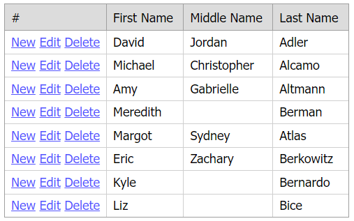

<!-- default badges list -->

[](https://supportcenter.devexpress.com/ticket/details/E4058)
[](https://docs.devexpress.com/GeneralInformation/403183)
<!-- default badges end -->
# Grid View for ASP.NET MVC - How to emulate command button functionality
<!-- run online -->
**[[Run Online]](https://codecentral.devexpress.com/128551452/)**
<!-- run online end -->

This example demonstrates how to add custom buttons to a templated column and configure the grid's cell edit functionality.



## Overview

Follow the steps below to emulate command button functionality:

1. Call a column's [SetDataItemTemplateContent](https://docs.devexpress.com/AspNetMvc/DevExpress.Web.Mvc.MVCxGridViewColumn.SetDataItemTemplateContent(System.Action-DevExpress.Web.GridViewDataItemTemplateContainer-)) method and add hyperlink controls to the template to create custom **New**, **Edit**, and **Delete** buttons. For all buttons, handle their client-side `Click` events and call the corresponding grid's method to edit data.

    ```cshtml
    settings.Columns.Add(column => {
        column.Caption = "#";
        column.SetDataItemTemplateContent(c => {
            Html.DevExpress().HyperLink(hl => {
                hl.Name = "hlNew_" + c.KeyValue.ToString();
                hl.NavigateUrl = "javascript:;";
                hl.Properties.Text = "New";
                hl.Properties.ClientSideEvents.Click = string.Format("function(s, e) {{ {0}.AddNewRow(); }}", settings.Name);
            }).Render();
            ViewContext.Writer.Write("&nbsp;");
            Html.DevExpress().HyperLink(hl => {
                hl.Name = "hlEdit_" + c.KeyValue.ToString();
                hl.NavigateUrl = "javascript:;";
                hl.Properties.Text = "Edit";
                hl.Properties.ClientSideEvents.Click = string.Format("function(s, e) {{ {0}.StartEditRow('{1}'); }}", settings.Name, c.VisibleIndex);
            }).Render();
            ViewContext.Writer.Write("&nbsp;");
            Html.DevExpress().HyperLink(hl => {
                hl.Name = "hlDelete_" + c.KeyValue.ToString();
                hl.NavigateUrl = "javascript:;";
                hl.Properties.Text = "Delete";
                hl.Properties.ClientSideEvents.Click = string.Format("function(s, e) {{ {0}.DeleteRow('{1}'); }}", settings.Name, c.VisibleIndex);
            }).Render();
        });
    });
    ```

2. Call a column's [SetEditItemTemplateContent](https://docs.devexpress.com/AspNetMvc/DevExpress.Web.Mvc.MVCxGridViewColumn.SetEditItemTemplateContent(System.Action-DevExpress.Web.GridViewEditItemTemplateContainer-)) and add a hyperlink control to the template to create a custom **Update** button. Handle the button's client-side `Click` event and call the grid's `UpdateEdit` method in the handler.

    ```cshtml
    column.SetEditItemTemplateContent(c => {
        ViewContext.Writer.Write("<div style=\"text-align: right;\">");
        Html.DevExpress().HyperLink(hl => {
            hl.Name = "hlUpdate";
            hl.NavigateUrl = "javascript:;";
            hl.Properties.Text = c.Grid.IsNewRowEditing
                ? "Add"
                : "Update";
            hl.Properties.ClientSideEvents.Click = string.Format("function(s, e) {{ {0}.UpdateEdit(); }}", settings.Name);
        }).Render();
        ViewContext.Writer.Write("</div>");
    });
    ```

## Files to Review

* [HomeController.cs](./CS/Sample/Controllers/HomeController.cs)
* [Person.cs](./CS/Sample/Models/Person.cs)
* [PersonsList.cs](./CS/Sample/Models/PersonsList.cs)
* [GridViewTemplatePartial.cshtml](./CS/Sample/Views/Home/GridViewTemplatePartial.cshtml)
* [Index.cshtml](./CS/Sample/Views/Home/Index.cshtml)

## Documentation

* [Data Editing in Grid](https://docs.devexpress.com/AspNetMvc/16140/components/grid-view/data-editing-and-validation/data-editing)
* [Templates](https://docs.devexpress.com/AspNetMvc/14721/common-features/templates)

## More Examples

* [Grid View for ASP.NET Web Forms - How to emulate command button functionality](https://github.com/DevExpress-Examples/asp-net-web-forms-grid-emulate-command-button-functionality)
